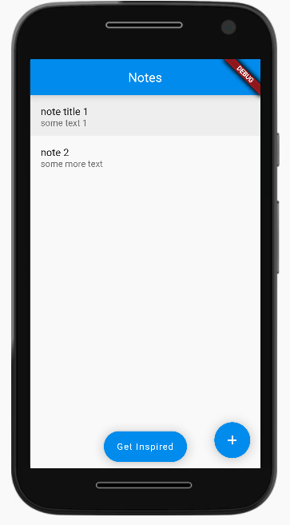
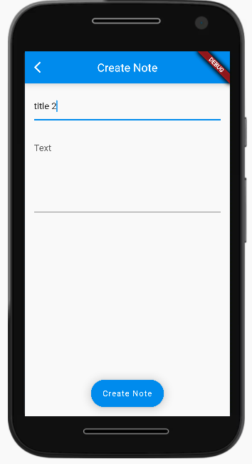
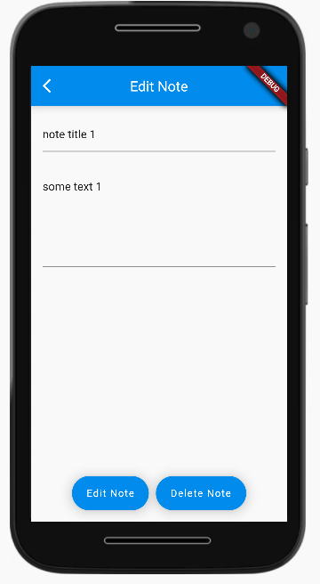
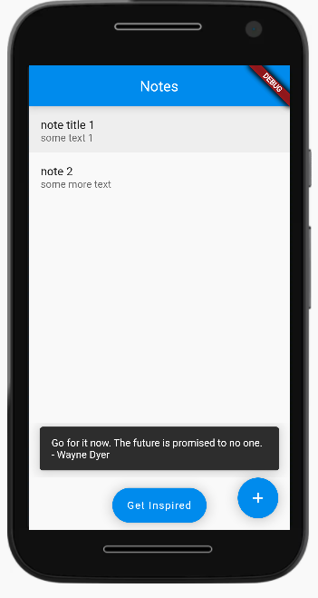

# Flutter Bootcamp - Note taking app (CapStone Project)

## Features

* create notes with title and text
* edit notes
* delete notes
* `Get Insprired` button that retrieves inspirational quotes from an api
* Store notes locally so they are persistant over sessions

## Screen shots

### Home

### Create note

### Edit note

### Get inspired

